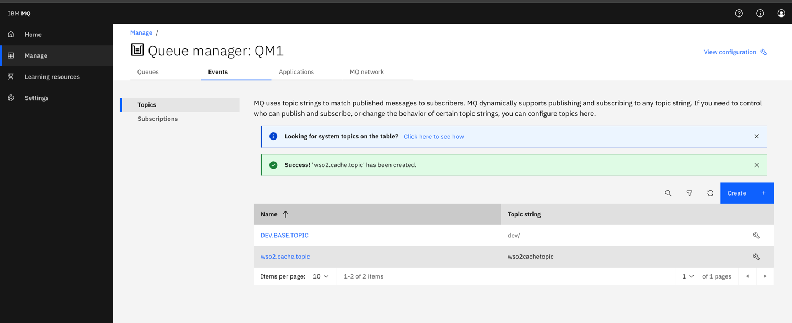
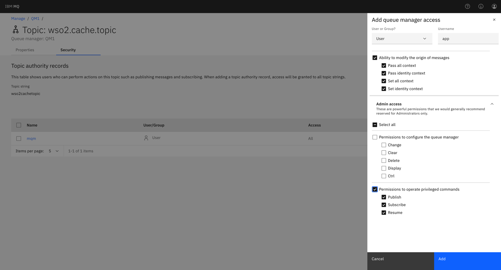

### Introduction

This will guide you to set up the IBM MQ to communicate over a topic using publish/subscribe 
(pub/sub) mechanism.

### Prerequisites:
Install IBM MQ and apply the latest fix pack (See [IBM documentation](https://www.ibm.com/docs/en/ibm-mq/9.3) for more information).

**Note:** The following steps are tested with IBM MQ 9.3.3.0 on docker with the default objects. ([Documentation for 
IBM MQ on container](https://developer.ibm.com/learningpaths/ibm-mq-badge/create-configure-queue-manager))

### Steps to follow:
1. When starting the container, a queue manager will be created with the name `QM1`.
   - To create a new queue manager, run the command `crtmqm qmName`.
   - To start the queue manager, run the command `strmqm qmName`.
   - To verify the status of the queue manager, run the command `dspmq`.
2. Access the IBM MQ console by navigating to `http://localhost:9443/ibmmq/console` and login with the admin credentials.
3. Create a new topic by navigating to `Events` tab.

4. Provide the publish/subscribe permissions for this topic for the user `app`.(This user is used in the IS server 
   to connect to the IBM MQ). To do this, 
   1. navigate to `Manage` -> `Events` and click on the `settings` icon of the 
      newly created topic.
   
   2. Click on the `Security` tab and click on `Add` button to add a new record
   
5. Create a `.bindings` file for the created topic and save it in a desired location in your computer. You need this
   when configuring the Identity Server (You can refer [this document](https://ei.docs.wso2.com/en/latest/micro-integrator/setup/brokers/configure-with-IBM-websphereMQ/#generating-the-bindings-file) on creating the .binding file)

   **Troubleshooting**:
    * If you are using MAC with Apple chip, you may need to create the docker image yourself. Refer this link for
      more information. [https://community.ibm.com/community/user/integration/blogs/richard-coppen/2023/06/30/ibm-mq-9330-container-image-now-available-for-appl]()
    * When building the docker, the IBM MQ version is defined by [this config](https://github.com/ibm-messaging/mq-container/blob/master/config.env#L4). The given version should be available in [this
      directory](https://public.dhe.ibm.com/ibmdl/export/pub/software/websphere/messaging/mqadv/) for download.
      Otherwise, the image creation will fail.
    * If you are using Rancher for docker, the port 9443 will not be accessible for the IBM MQ console. Therefore 
      use the port 9243 for the MQ console. 
    * To create the `.binding` file you need to install the IBM MQ Explorer. If that is not supported in your OS, 
      you can use a java sample code to generate the `.bindings` file defining the configurations. (**This is only 
      for testing purposes**)
