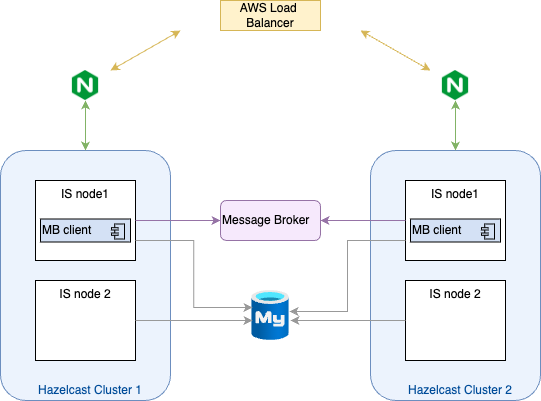

## Introduction

To evaluate the performance impact of using an additional connector that would pass the cache invalidation messages 
to a third-party message broker, we performed several performance test rounds. 

This is the base deployment for performance tests where there are two clusters each having two nodes of Identity 
Server. All the IS nodes are connected to a shared database.

### Test Scenario 1: Single Cluster Deployment

For the first test round, we selected a deployment that will have only one cluster active all the time and with the
following configurations. This performance test is intended to validate, whether
there is any performance impact for a given data center with and without the connector in place.

Setup 1: One cluster serving the traffic and the connector is disabled

Setup 2: One cluster serving the traffic, the connector is enabled and connected with Active MQ

Setup 3: One cluster serving the traffic, the connector is enabled and connected with IBM MQ

Here are the test results,

**Setup 1: Without the cache invalidation message broker connector**

| Scenario Name                                  | Concurrency | # Samples | Throughput (transactions/sec) | Average Response Time (ms) | error % |
|------------------------------------------------|-------------|-----------|-------------------------------|----------------------------|---------|
| OIDC Auth Code Grant Redirect With Consent     | 50          | 135343    | 451.27                        | 107.71                     | 0.00%   |
|                                                | 150         | 144232    | 480.13                        | 303.86                     | 0.00%   |
|                                                | 300         | 141126    | 470.31                        | 612.12                     | 0.00%   |
|                                                | 500         | 142079    | 473.3                         | 992.95                     | 1.79%   |
| Password Grant Token Request and revocation   | 50          | 71736     | 239.1                         | 205.32                     | 0.00%   |
|                                                | 150         | 71862     | 239.2                         | 615.47                     | 0.00%   |
|                                                | 300         | 71183     | 236.81                        | 1242.13                    | 0.00%   |
|                                                | 500         | 69209     | 229.6                         | 2130.84                    | 1.47%   |

**Setup 2: Active MQ as the message broker for the cache invalidation messages.**

| Scenario Name                                  | Concurrency | # Samples | Throughput (Requests/sec) | Average Response Time (ms) | error % |
|------------------------------------------------|-------------|-----------|----------------------------|----------------------------|---------|
| OIDC Auth Code Grant Redirect With Consent     | 50          | 133414    | 444.83                     | 109.21                     | 0.00%   |
|                                                | 150         | 144186    | 480.23                     | 304.02                     | 0.00%   |
|                                                | 300         | 142084    | 473.08                     | 603.25                     | 0.00%   |
|                                                | 500         | 143606    | 477.53                     | 961.88                     | 2.35%   |
| Password Grant Token Request and revocation   | 50          | 71674     | 238.94                     | 205.48                     | 0.00%   |
|                                                | 150         | 71744     | 238.81                     | 616.52                     | 0.00%   |
|                                                | 300         | 71261     | 237.05                     | 1240.82                    | 0.00%   |
|                                                | 500         | 69764     | 231.11                     | 2116.43                    | 0.51%   |

**Setup 3: IBM MQ as the message broker for the cache invalidation messages.**

| Scenario Name                                  | Concurrency | # Samples | Throughput (Requests/sec) | Average Response Time (ms) | error % |
|------------------------------------------------|-------------|-----------|----------------------------|----------------------------|---------|
| OIDC Auth Code Grant Redirect With Consent     | 50          | 135986    | 453.36                     | 107.3                     | 0.00%   |
|                                                | 150         | 145164    | 483.88                     | 301.84                    | 0.00%   |
|                                                | 300         | 142652    | 474.31                     | 607.38                    | 0.00%   |
|                                                | 500         | 145423    | 482.97                     | 976.82                    | 2.70%   |
| Password Grant Token Request                   | 50          | 36900     | 122.98                     | 399.04                    | 0.00%   |
|                                                | 150         | 37006     | 123.2                      | 1194.43                   | 0.00%   |
|                                                | 300         | 36864     | 122.55                     | 2397.55                   | 0.00%   |
|                                                | 500         | 39614     | 131.24                     | 3715.92                   | 6.46%   |
| Password Grant Token Request and revocation   | 50          | 71547     | 238.48                     | 205.89                    | 0.00%   |
|                                                | 150         | 71914     | 239.43                     | 614.93                    | 0.00%   |
|                                                | 300         | 70336     | 233.9                      | 1258.11                   | 0.00%   |
|                                                | 500         | 69516     | 230.46                     | 2121.35                   | 1.28%   |

### Test Scenario 2: Multi Cluster Deployment

For the second test round, we selected multi cluster deployment where both the clusters will serve the traffic. In 
this scenario, we try to validate the performance impact of the connector when it is both publishing and receiving 
the cache invalidation messages. The scenario we are trying are not affected by the cache syncing issue when the 
connector is disabled because all the requests of a single flow will be routed to the same cluster.

Setup 1: Both clusters serving the traffic and the connector is disabled

Setup 2: Both clusters serving the traffic, the connector is enabled and connected with Active MQ

Setup 3: Both clusters serving the traffic, the connector is enabled and connected with IBM MQ

**Setup 1: Without the cache invalidation message broker connector**

| Scenario Name                                  | Concurrency | # Samples | Throughput (transactions/sec) | Average Response Time (ms) |
|------------------------------------------------|-------------|-----------|-------------------------------|----------------------------|
| OIDC Auth Code Grant Redirect With Consent     | 50          | 137094    | 457.02                        | 106.37                     |
|                                                | 150         | 143465    | 477.79                        | 304.99                     |
|                                                | 300         | 140536    | 468.34                        | 615.81                     |
|                                                | 500         | 137221    | 455.77                        | 1025.56                    |
| Password Grant Token Request and revocation   | 50          | 71468     | 238.23                        | 206.08                     |
|                                                | 150         | 71530     | 238.16                        | 618.14                     |
|                                                | 300         | 70564     | 234.35                        | 1254.43                    |
|                                                | 500         | 65581     | 217.68                        | 2242.6                     |

**Setup 2: Active MQ as the message broker for the cache invalidation messages.**

| Scenario Name                                  | Concurrency | # Samples | Throughput (Requests/sec) | Average Response Time (ms) |
|------------------------------------------------|-------------|-----------|----------------------------|----------------------------|
| OIDC Auth Code Grant Redirect With Consent     | 50          | 136513    | 455.15                     | 106.89                    |
|                                                | 150         | 142497    | 474.49                     | 307.67                    |
|                                                | 300         | 140753    | 468.86                     | 615.11                    |
|                                                | 500         | 137833    | 458.22                     | 1028.8                    |
| Password Grant Token Request and revocation   | 50          | 71481     | 238.25                     | 206.12                    |
|                                                | 150         | 71176     | 237.03                     | 621.14                    |
|                                                | 300         | 69392     | 230.74                     | 1274.62                   |
|                                                | 500         | 68378     | 225.96                     | 2166.25                   |

**Setup 3: IBM MQ as the message broker for the cache invalidation messages.**

| Scenario Name                                  | Concurrency | # Samples | Throughput (Requests/sec) | Average Response Time (ms) |
|------------------------------------------------|-------------|-----------|----------------------------|----------------------------|
| OIDC Auth Code Grant Redirect With Consent     | 50          | 135811    | 452.73                     | 107.35                    |
|                                                | 150         | 144115    | 480.04                     | 303.94                    |
|                                                | 300         | 138547    | 461.23                     | 624.01                    |
|                                                | 500         | 138311    | 460.64                     | 1024.13                   |
| Password Grant Token Request and revocation   | 50          | 71518     | 238.43                     | 205.84                    |
|                                                | 150         | 71486     | 238.11                     | 618.27                    |
|                                                | 300         | 70749     | 235.53                     | 1248.64                   |
|                                                | 500         | 69579     | 230.11                     | 2124.18                   |
